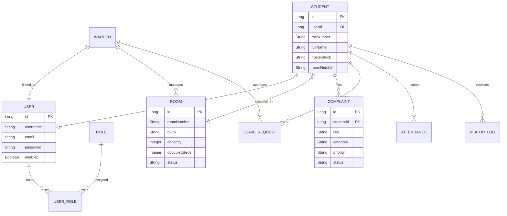

# Smart Hostel Safety & Management Platform — Enterprise System Documentation

## 1. Executive System Architecture

The **Smart Hostel Management System** is built as an enterprise-grade multi-tier web application, featuring a React Single Page Application (SPA) frontend, dual Spring Boot microservices backend (`authentication-service` and `authorization-service`), Oracle XE relational database for operational business data, and MongoDB for audit log archives and AI chat histories.

```
                  ┌──────────────────────────────────────────────────┐
                  │          React 18 SPA Frontend (Vite)            │
                  │   TailwindCSS · Lucide Icons · Recharts Analytics│
                  └────────────────────────┬─────────────────────────┘
                                           │
                                           │ HTTP / HTTPS (JWT Bearer)
                                           ▼
                  ┌──────────────────────────────────────────────────┐
                  │         Nginx Reverse Proxy / Load Balancer      │
                  └────────────┬─────────────────────────┬───────────┘
                               │                         │
            /api/v1/auth/*     │                         │ /api/v1/*
                               ▼                         ▼
            ┌──────────────────────────────┐ ┌──────────────────────────────┐
            │  Authentication Service      │ │   Authorization Service      │
            │  (Spring Boot 3 - Port 8081) │ │  (Spring Boot 3 - Port 8082) │
            │  JJWT · BCrypt · Auth Controller│ │  Hostel Controllers · Security│
            └──────────────┬───────────────┘ └──────────────┬───────────────┘
                           │                               │
                           └───────────────┬───────────────┘
                                           │
                        ┌──────────────────┴──────────────────┐
                        │                                     │
                        ▼                                     ▼
            ┌───────────────────────┐             ┌───────────────────────┐
            │   Oracle XE Database  │             │   MongoDB Document DB │
            │ (JPA Relational Model)│             │ (Audit Logs & AI Hist)│
            └───────────────────────┘             └───────────────────────┘
```

---

## 2. Directory & Repository Structure

```text
d:\full stack\
├── docker-compose.yml                      # Production multi-container orchestration
├── SYSTEM_DOCUMENTATION.md                  # Comprehensive enterprise documentation
├── smart-hostel-safety-platform/           # React 18 Frontend Application
│   ├── Dockerfile                           # Multi-stage Node + Nginx Docker build
│   ├── nginx.conf                           # Reverse proxy, compression & fallback
│   ├── package.json                         # Dependencies (Vite, React, Lucide, Recharts)
│   └── src/
│       ├── App.jsx                          # Main App with Suspense & ErrorBoundary
│       ├── components/common/               # ErrorBoundary, Card, Modal, Input, Badge
│       ├── context/HostelContext.jsx        # Hydrated global state & live refreshData
│       ├── hooks/                           # useAuth, useTable (with CSV export), useIdleTimer
│       ├── pages/                           # Admin, Warden, Student & Shared views
│       └── services/                        # api, authService, studentService, wardenService, adminService, aiService
└── Two Services/                            # Backend Microservices
    ├── authentication-service/              # Identity Provider & Auth Service (Port 8081)
    │   ├── Dockerfile                       # Maven + Temurin JRE multi-stage image
    │   └── src/main/resources/application-prod.yml
    └── authorization-service/               # Core Hostel Business Service (Port 8082)
        ├── Dockerfile                       # Maven + Temurin JRE multi-stage image
        └── src/main/resources/application-prod.yml
```

---

## 3. Database Schema & Entity Relationship Diagram (ERD)



---

## 4. API Specification Summary

### Authentication Service (`http://localhost:8081/api/v1`)
- `POST /auth/register` — Registers new user with roles (`STUDENT`, `WARDEN`, `ADMIN`).
- `POST /auth/login` — Returns JWT Access Token (24h) and Refresh Token (7d).
- `POST /auth/logout` — Purges session data.
- `GET /auth/me` — Fetches current user profile.

### Authorization Service (`http://localhost:8082/api/v1`)
- `GET /dashboards/student`, `/warden`, `/admin` — Summarized role metrics.
- `GET/POST/PUT/DELETE /students` — Student CRUD management.
- `GET/POST/PUT/DELETE /wardens` — Warden management.
- `GET/POST /rooms` & `/rooms/allocate` — Room management and allocation.
- `GET/POST /attendance` & `/attendance/bulk` — Daily attendance marking.
- `GET/POST/PUT /complaints` & `/status` — Complaint tracking.
- `GET/POST/PUT /leave-requests` & `/status` — Leave management.
- `GET/POST /visitors` & `/visitors/logs` — Gate visitor verification logs.
- `GET/POST /mess/food-wastage` & `/feedback` — Mess analytics and ratings.
- `GET/POST /resources` & `/utilities` — Resource and utility anomaly monitoring.

---

## 5. Deployment Guide

### Option A: Standard Production Docker Deployment
1. Navigate to the project root directory:
   ```bash
   cd "d:/full stack"
   ```
2. Build and start all services via Docker Compose:
   ```bash
   docker-compose up -d --build
   ```
3. Access the services:
   - **React Application:** `http://localhost`
   - **Auth Service:** `http://localhost:8081/swagger-ui.html`
   - **Authz Service:** `http://localhost:8082/swagger-ui.html`

### Option B: Local Development Run
1. **Frontend:**
   ```bash
   cd smart-hostel-safety-platform
   npm install
   npm run dev
   ```
2. **Backend Services:**
   Run Spring Boot applications on ports `8081` and `8082`.

---

## 6. User Manuals

### 6.1 Student Manual
- **Sign In:** Use registered username or email with password.
- **File Complaints:** Click "New Complaint", select category, title, and priority.
- **Apply for Leave:** Enter start/end dates and reason. Track approval status in real-time.
- **Visitor Requests:** Register upcoming visitors to receive gate check-in verification codes.

### 6.2 Warden Manual
- **Student & Room Management:** Allocate students to available rooms, view block occupancy.
- **Bulk Attendance:** Mark nightly room presence with single-click bulk updates.
- **Approve Leave & Visitors:** Review pending requests and provide remarks.
- **Mess & Resource Tracking:** Log daily food wastage (kg) and monitor utility anomalies.

### 6.3 Admin Manual
- **System Dashboard:** View system-wide metrics, active wardens, total students, and open incidents.
- **Manage Wardens:** Add or remove hostel wardens and assign block responsibilities.
- **Audit Logs:** Monitor security login histories and API request logs exported from MongoDB.
